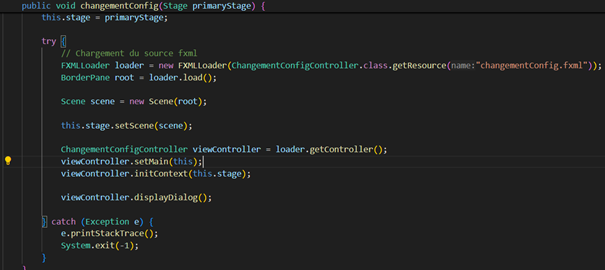
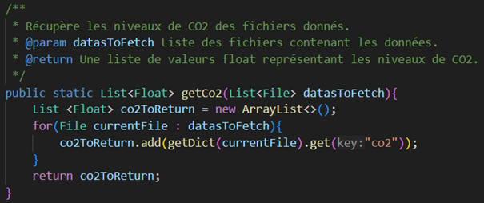

= Documentation technique Java - Sweetshops
:toc:
:toc-title: Sommaire
:Entreprise: LudoRama
:Equipe: LudoRama / G1A-3

== Présentation de l'application

L'application Java développée permet principalement à l'ensemble des utilisateurs de recueillir des données de différents capteurs.
De plus, il peut choisir quelles données recueillir parmi l'ensemble de celles récupérables, les seuils à partir desquels une alerte sera levée, et lancer le programme qui récupère les données.
L'affichage des données se fait de différentes manières : celles-ci sont soit affichées sous forme de graphes, soit sous forme de valeurs.
Cela permet à l'utilisateur de pouvoir avoir la donnée précise qu'il souhaite, ou autrement d'avoir une idée de comment les données ont varié durant une période donnée.

== Procédure d'installation

=== Pour le développement 

Afin de réaliser ce projet de la bonne manière, nous avons installé l'IDE Visual Studio Code, nous permettant de travailler assidument sur l'ensemble des langages.
A cela s'ajoute l'installation de Python et de Java afin de faire tourner l'ensemble des programmes réalisés.

=== Pour le poste
Pour le poste de l'utilisateur, il sera seulement nécessaire d'installer Java et Python, afin que le logiciel tourne de manière adéquate.

== Use Case Global
(Expliquer le use case global)(types d'utilisateurs, spécificités...)

== Architecture 
=== Architecture générale 

L'application est composée en 3 parties sur l'aspect Java : des contrôleurs, une application principale qui permet de changer les scènes, et les classes "outils" qui servent à séparer certaines méthodes pour simplifier le code.
A cela s'ajoute l'ensemble des vues que sont les fichiers FXML permettant à l'utilisateur de naviguer correctement dans l'application.

=== Structuration en package de l'application 

L'idée principale de cette application était de développer une application dite MVC, ou Model View Controller. Cela semblait cohérent de par le fait que l'application contient des vues et des contrôleurs, or, nous ne possédons aucun modèle.
Cela impose la limite du modèle MVC auquel nous nous tenions au départ. Cependant si l'on considère que nos contrôleurs effectuent des opérations sur nos données, alors ces derniers peuvent être considérs comme des modèles.
Nos packages sont donc séparés de sorte à ce que le code suive une logique MVC. Afin que le travail soit facilité, nous avons unis nos contrôleurs et nos vues dans un dossier princpal appelé "view".

=== Élements essentiels 

L'application dévelopée pour le groupe SweetShops contient certaines particularités. Tout d'abord, nous devons souligner l'utilisation de threads.
Ces derniers permettent à l'application d'actualiser les données obtenues en direct par le programme Java pour l'un, et d'exécuter le programme Python en parallèle de l'application Java pour l'autre.
ATTENTION, le programme Python étant exécuté par le Thread ne s'interrompt pas à la fermeture de l'application.
Si vous souhaitez le fermer, vous devrez aller dans votre gestionnaire de tâches (sur Windows) ou toute application de gestion équivalente afin de rechercher le programme Python et de terminer la tâche.

== Fonctionnalités 

=== Package : src/main/java/

==== control

Le package control contient uniquement la classe principale qui sert à la gestion.
Celle-ci permet de lancer l'ensemble des pages à l'aide de leurs contrôleurs et de leurs vues.
Ci-joint l'exemple d'une méthode appelant l'un des contrôleurs et sa vue :

==== tools

Le package tools contient les classes "outils" que nous avons utilisé. Celles-ci sont au compte de deux.
La première est DataReader. Cette classe nous permet de récupérer les données des fichiers obtenus par notre programme Python dans un format facile d'utilisation.
Ci-dessous sera présent l'exemple de la méthode permettant de récupérer l'ensemble des données de CO2 des fichiers fournis :

La deuxième classe "outil" est FichierConfig. Elle permet de remplacer les données saisies dans le fichier config.ini convenablement.

==== view

Le package view est le plus complet et fourni des packages.
Celui-ci contient l'ensemble des contrôleurs présents dans notre application. Ils sont 6, au même nombre que l'ensemble de vues présentes à l'utilisateur.

Le premier contrôleur, ChangmentConfigController, est associé à la page des modifications du fichier de configuration. Il permet que l'ensemble des données soient correctement modifiées par l'utilisateur.

Le deuxième, ChoixTypeDonneesController, est quant à lui associé à la page du choix des données antérieures souhaitées par l'utilisateur.
Celui-ci permet de sélectionner l'ensemble des données voulues à l'utilisateur afin de ne pas avoir de données redondantes ou inutiles à son usage qui apparaissent sur son écran.

Le troisième contrôleur, DonneesActuellesController, est le contrôleur principal de la partie des données actuelles.
Celui-ci fait appel à un thread afin de traiter le nombre de fichiers, et lorsque celui-ci se modifie, alors il va chercher le dernier fichier pour l'afficher dans la vue associée.
Il permet de plus de donner la bonne information à la vue afin que celle-ci soient adéquates pour l'utilisateur.

Le quatrième contrôleur, DonneesAnterieuresController, est le contrôleur principal de la partie des données antérieures.
Il sert à afficher les données antérieures obtenues par le fichier python sous forme de graphique, afin que l'utilisateur puisse voir les données sélectionnées durant les dates sélectionnées.
Il permet de trouver les fichiers de la bonne période, d'obtenir les données à l'aide de la classe DataReader, puis de les mettre sous forme de graphiques, et d'afficher les graphiques demandés.

Le cinquième et avant dernier contrôleur, MenuController, est le menu principal de l'application.
Il sert à ce que l'ensemble des boutons du menu soient fonctionnels, et à ce que les actions qu'ils effectuent soient les bonnes.

Le dernier contrôleur, SolaredgeAnterieurController, est à l'image du quatrième contrôleur, or, ce dernier n'affiche que les anciennes données des panneaux solaires.
Ici, il ne traite donc qu'une information essentielle (l'énérgie actuelle contenue) et affiche directement l'unique graphique qui lui est associé.

=== Package : src/main/ressources/

==== view

Ce package contient l'ensemble des vues de l'application. Chacune de ces vues est associée à l'un des contrôleurs précédemment présentés.
Ces fichiers permettent de lancer l'affichage visuel sur lequel travaille les contrôleurs.
Il semble répétitif de présenter chacune des vues, celles-ci étant à l'image de leurs contrôleurs.
