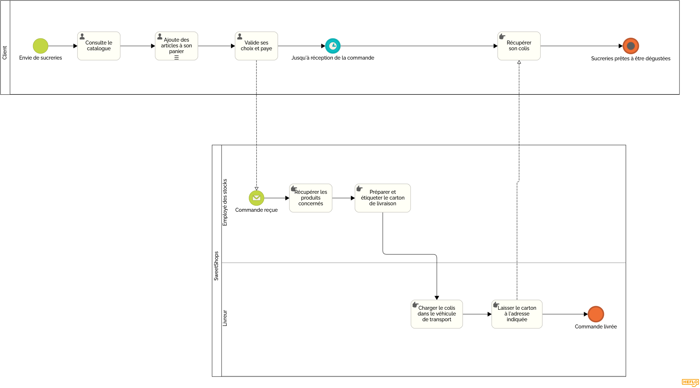

= Fiche de conseils juridiques et de sécurité
:toc:
:toc-title: Sommaire
:Entreprise: LudoRama
:Equipe: LudoRama

== 1. Mentions Légales Obligatoires

=== Liste des mentions légales obligatoires que doit comporter le site WEB

* Identification de l'éditeur du site
 ** Nom de l'entreprise
 ** Adresse de l'entreprise
 ** Numéro de téléphone de l'entreprise
 ** E-Mail de l'entreprise
 ** Numéro SIRET
 ** RCS (Registre du commerce et des sociétés)
 ** TVA intra-communautaire

* Responsable de la publication
 ** Nom et prénom

* Hébergeur
 ** Nom de l'hébergeur
 ** Adresse de l'hébergeur
 ** Numéro de téléphone de l'hébergeur
 ** E-Mail de l'hébergeur
 ** Mentions relatives aux cookies

* Conditions générales de vente (CGV)
 ** Modalités de paiement
 ** Délai de retractation
 ** Politique de confidentialité et protection des données personnelles

* Traitement des données personnelles et utilisation de cookies
* Présence de mentions CNIL

=== Mentions légales actuellement manquantes sur le site WEB

Toutes les obligations sus-mentionnées ont été implémentée correctement sur notre site.

== 2. Processus de vente en ligne

Description détaillée du processus de vente en ligne à l’aide d’un diagramme de collaboration BPMN.

=== Diagramme BPMN

== 3. Protection des données

Une liste de mesures applicables et leurs modalités de mise en œuvre concernant la protection des données.

[cols="3*"]
|====
|Mesure |Modalités |Priorité

// 01
|Consentement au traitement des données
|Recueilli lors de la création du compte
|Élevée

// 02
|Droits des utilisateurs (accès, rectification, suppression)
|Formulaire de demande dans l'espace client
|Moyenne

// 03
|Limitation des données collectées
|Collecte uniquement des données strictement nécessaires
|Moyenne
|====

== 4. Sécurité des données

Une liste de mesures applicables et leurs modalités de mise en œuvre concernant la sécurité des données (sur le même modèle que ci-dessus).

[cols="3*", options="header"]
|====
|Mesure |Modalités |Priorité

// 01
|Sécurisation des connexions
|Utilisation du protocole HTTPS
|Élevée

// 02
|Gestion des mots de passe
|Stockage chiffré des mots de passe (hashage avec salage)
|Élevée

// 03
|Protection contre les attaques
|Mise en place d'un pare-feu et surveillance des journaux
|Élevée

// 04
|Sauvegarde des données
|Plan de sauvegarde hebdomadaire avec vérification
|Moyenne
|====

== 5. User Stories (US) à ajouter au dernier sprint

La liste des US à ajouter au dernier sprint pour tenir compte des points 3 et 4 les plus importants (à négocier avec votre client en fonction des priorités !).

**Protection des données**

* **US 01 :** En tant que client, je veux qu'on me demande mon consentement de façon explicite lors de la création de mon compte.
* **US 02 :** En tant que client, je veux pouvoir accéder à mes données personnelles via un formulaire.

**Sécurisation des données**

* **US 03 :** En tant qu'administrateur, je veux que toutes les connexions soient chiffrées pour garantir la sécurité des informations échangées.
* **US 04 :** En tant que client, je veux que mes mots de passe soient stockés de manière sécurisée pour éviter tout vol de mes informations personnelles.

== Annexe

=== Ressources utiles

* CNIL +
https://www.cnil.fr/fr/rgpd-en-pratique-communiquer-en-ligne +
https://www.cnil.fr/fr/reglement-europeen-protection-donnees

* Gouvernement & Service public +
https://entreprendre.service-public.fr/vosdroits/F31228 +
https://www.economie.gouv.fr/entreprises/site-internet-mentions-obligatoires#
